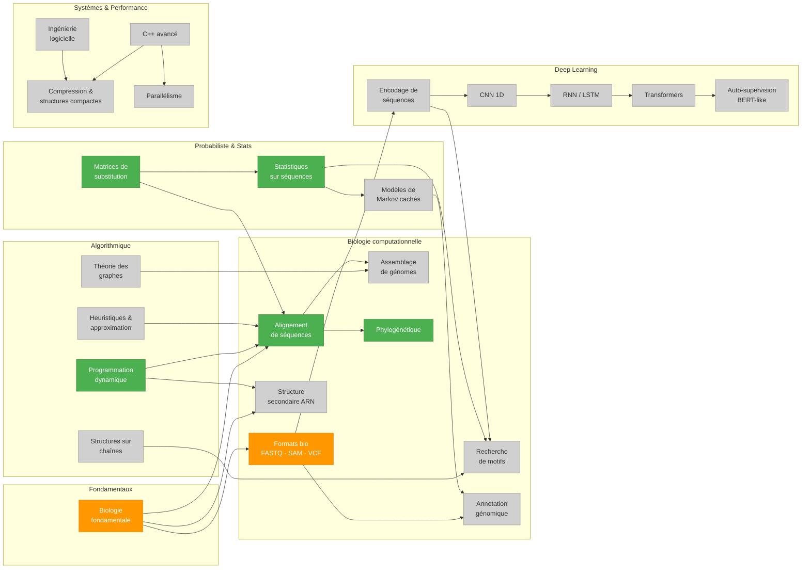

# Graphe de compétences

Visualisation des compétences à acquérir, leurs dépendances, et les projets qui les couvrent.

**Légende des couleurs :**
- Gris — non couvert
- Vert — couvert par au moins un projet
- Orange — partiellement couvert (introduit mais pas approfondi)

---

## Graphe



---

## Tableau de couverture

| ID | Compétence | Domaine | Priorité | Projet(s) |
|----|-----------|---------|----------|-----------|
| BIO_BASE | Biologie fondamentale (ADN/ARN, dogme central, séquençage) | Fondamentaux | Essentielle | `sequence-aligner` (partial) |
| SWE | Ingénierie logicielle (typage, tests, API design, modules) | Systèmes & Performance | Haute | — |
| PD | Programmation dynamique | Algorithmique | Essentielle | `sequence-aligner` |
| SC | Structures de données sur chaînes (suffix array, BWT) | Algorithmique | Haute | — |
| GR | Théorie des graphes (De Bruijn, overlap) | Algorithmique | Haute | — |
| HEU | Heuristiques & approximation (BLAST-like) | Algorithmique | Moyenne | — |
| ALI | Alignement de séquences | Biologie computationnelle | Essentielle | `sequence-aligner` |
| MOT | Recherche de motifs biologiques | Biologie computationnelle | Haute | — |
| ASS | Assemblage de génomes | Biologie computationnelle | Haute | — |
| ANN | Annotation génomique | Biologie computationnelle | Moyenne | — |
| PHY | Phylogénétique computationnelle | Biologie computationnelle | Moyenne | `phylo-builder` |
| FMT | Formats bio standards (FASTQ, SAM/BAM, VCF) | Biologie computationnelle | Essentielle | `sequence-aligner` (partial — FASTA uniquement) |
| RNA | Structure secondaire ARN | Biologie computationnelle | Moyenne | — |
| HMM | Modèles de Markov cachés | Probabiliste & Stats | Haute | — |
| MST | Matrices de substitution (BLOSUM, PAM) | Probabiliste & Stats | Haute | `sequence-aligner` |
| STA | Statistiques sur séquences (p-value, PWM) | Probabiliste & Stats | Haute | `sequence-aligner` (partial — GC content, benchmarking) · `phylo-builder` (bootstrap, modèles évolutifs) |
| ENC | Encodage de séquences (one-hot, k-mer) | Deep Learning | Essentielle | — |
| CNN | Réseaux convolutifs 1D | Deep Learning | Haute | — |
| RNN | Réseaux récurrents / LSTM | Deep Learning | Haute | — |
| TRF | Transformers / mécanisme d'attention | Deep Learning | Haute | — |
| SSL | Auto-supervision (pré-entraînement BERT-like) | Deep Learning | Moyenne | — |
| CPP | C++ avancé (templates, mémoire, STL) | Systèmes & Performance | Moyenne | — |
| CMP | Compression & structures compactes | Systèmes & Performance | Basse | — |
| PAR | Parallélisme (threads, SIMD) | Systèmes & Performance | Basse | — |

---

## Comment mettre à jour ce fichier

Lors de l'initialisation d'un nouveau projet :

1. **Tableau** : remplir la colonne `Projet(s)` pour chaque compétence couverte
2. **Graphe Mermaid** : déplacer les IDs des compétences couvertes du `class ... unset` vers `class ... covered` (ou `partial`)

Exemple — si le projet `alignment/` couvre PD, MST et ALI complètement, HEU partiellement :
```
class PD,MST,ALI covered
class HEU partial
class SC,GR,MOT,... unset
```
